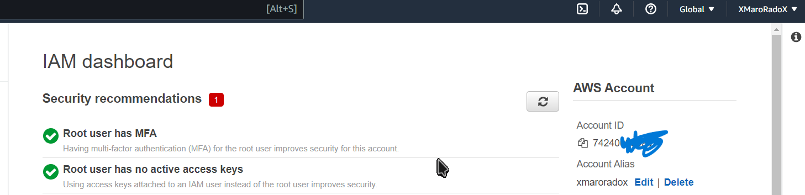

# 💻 Week 0 — Billing and Architecture 💡

## 🕰️ Learning Time
### 🏗️ C4 Model

>I am watching the C4 Model video (https://youtu.be/x2-rSnhpw0g)

📝 Notes about it:

* Nobody likes UML (Unified language model) and rarely it is used, especially when the team is moving fast because it is not familiar to many people and has differences among them. 😒
* Communication is essential when doing team projects. Different people need to be presented with the information about the architecture according to their understanding. 💬
* C4 stands for Context, Containers, Components, and Code. It gives a map-like view of the structure, going from context -> containers -> components -> code. Going more to the right means you are viewing a more detailed view. 🗺️
* System context: shows how people and software interact with each other without mentioning details. It gives a good overview for non-technical people. 👥
* Containers: shows each component in the context view in a more detailed view and how it works, mentioning its technologies without going into more detail. 📦
* Components: going more into detail about each container, describing each component in it. 🔩
* Code: it is not worth doing because you can automate doing them by your IDE (plantuml), but if you want to diagram this level, you will most probably use UMLs. 💻
* Notation: try to be short and meaningful and concise. Be specific and clear about what it is describing. 🖋️
* Acronym: make sure the domain knows about the acronyms you are using. 🤝
* Elements: visual consistency is essential (using boxes would be useful if it is added with the name, description, and function). Try to keep it short. 📐
* Lines: try to make it uni-directional and use fewer arrows if possible in multi-directional relation when the result is not vague. Avoid simple descriptions. ➡️
* Making the diagram readable would ensure work is continuous even if the group working on the project changes. 🧐
* Some tools to work with: plantuml and structurizr. 🛠️

### Chirag Nayyar Video about the free tier 💸
##### Notes about it:

* Bills Section contains each service and classifies them by region.
* Noticed that the forecast on the homepage is different from the bills section. 🤔
* You can set alarms from CloudWatch. ⏰
* 10 alarms are free. 🔟
* I should use tags to categorize resources to make budget analytics better. 🏷️
### Generating Credentials video

Notes about it:

* CloudShell depends on the region.
* Use`aws --cli-auto-prompt` to make the CLI auto-suggest commands.
* CLI is fun.
* Set up the CLI and updated the Gitpod config.
* Created a budget using the CLI.
* Created an alarm too.

### Security Video

Notes about it:

* Security is gradual and is incremented gradually.
* Added MFA authentication to my root account.
* Enabled CloudTrail.
* Set up Organizations and SCPs.

## Homework Section 📝

* Link to Conceptual diagram : https://lucid.app/lucidchart/39d55e21-be61-41c3-8378-1d49c0b8181f/edit?viewport_loc=-1070%2C-878%2C2371%2C1312%2C0_0&invitationId=inv_26eae480-c0d3-433b-9689-f1b922e1169d

  
* Link to Logical Diagram : https://lucid.app/lucidchart/0d14a873-d6bc-47fe-8d4a-0d66b607da3f/edit?view_items=C09x.ijlKOVN&invitationId=inv_1b1419a4-4c03-4856-a447-c979b25fbab5

  
* My Napkin Design

  

## Homework Challenges

* destoryed root account and set mfa
  
* hooked eventbridge to the health dashboard and added it to an sns topic
  
* reviewed the questions in the well archeticted framework
* tried to submit a ticket but didn't go through with it

* Architectural Diagram of CI/CD
  Link to it : https://lucid.app/lucidchart/97d006ab-6693-497b-9090-9bfa5db3968c/edit?viewport_loc=99%2C-146%2C2035%2C1312%2C0_0&invitationId=inv_2797e15b-ecfb-4548-a1ca-7a4041b7c8ec

> Any Proof of work will also be found as a named picture in `assets/week0`
