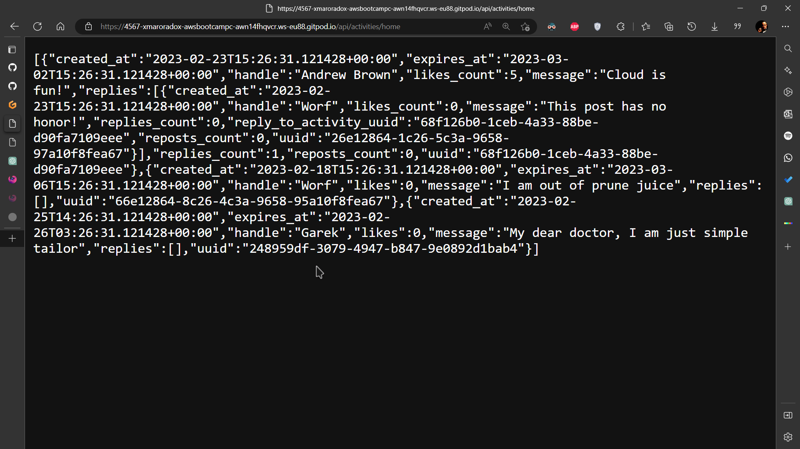
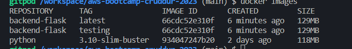
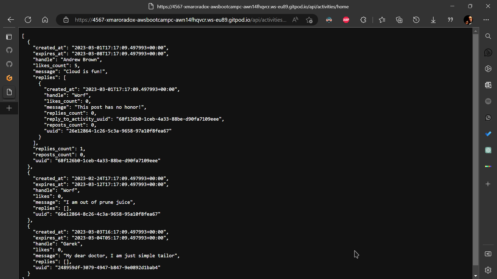
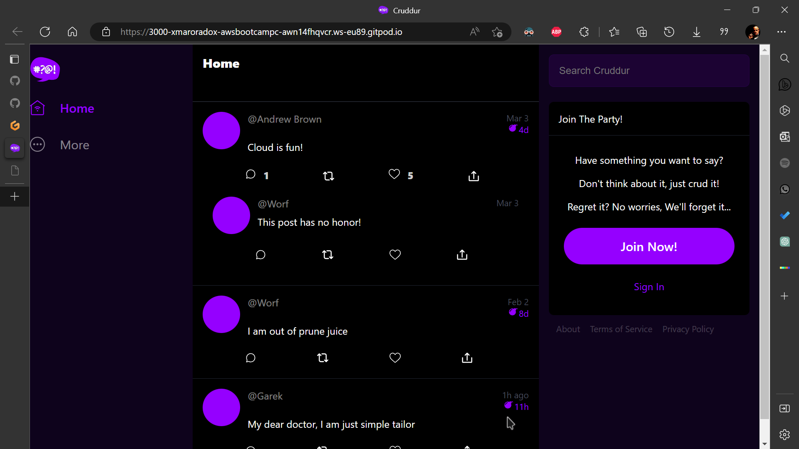
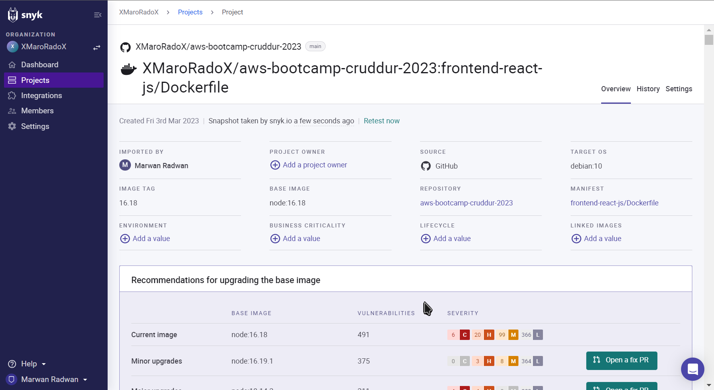
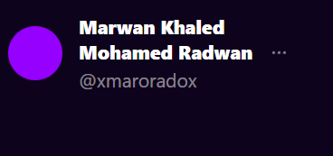
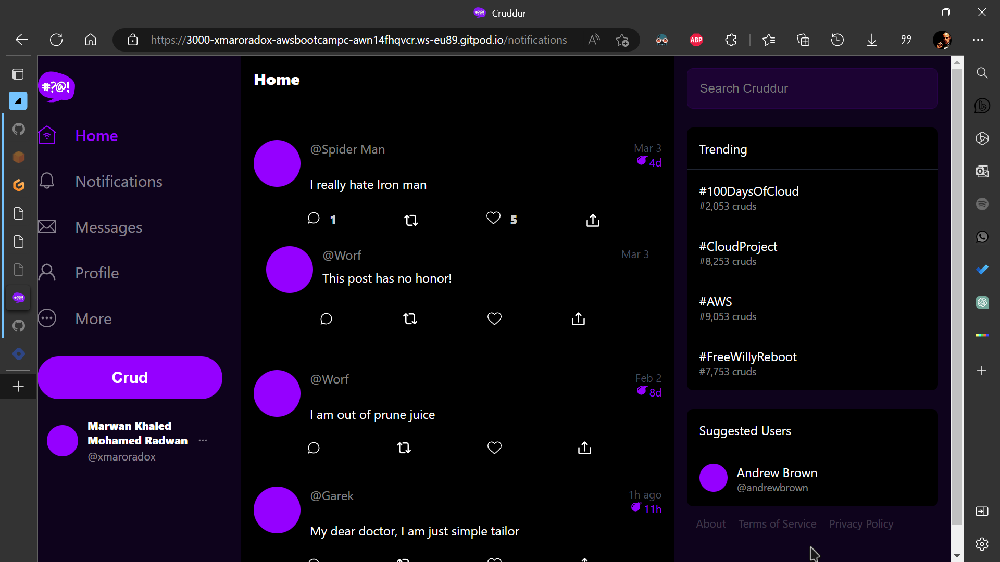
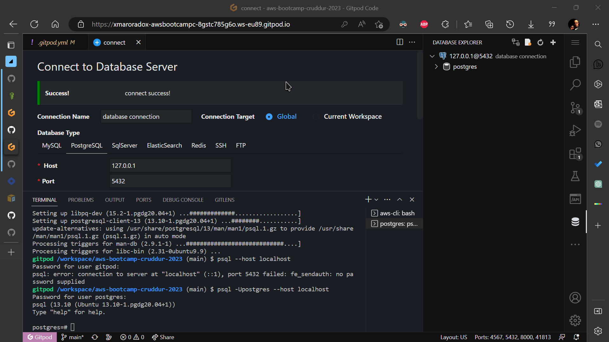
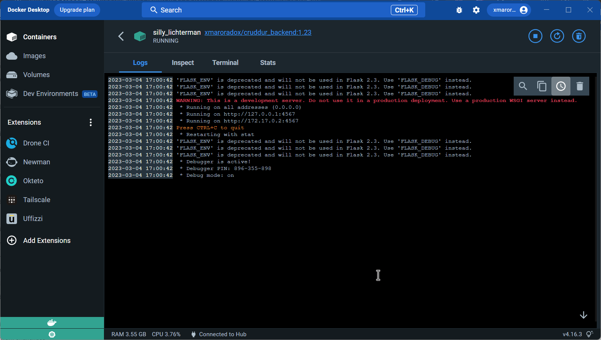

# Week 1 — App Containerization 🐳

## Learning Time 📖

### Pre-requisite Learning 🚀
Preparing for class I watched a video recommneded by Jason Paul by [Techworld With Nana](https://youtu.be/pg19Z8LL06w)
Highly Recommeded for anyone wanting to learn about docker 
#### It went through :
 * What is docker, dockerhub and why would you want to used it in your devleopment enviroment
 * Going through basic commands and handling the containers themselves
 * Deploying a small app using a dockerfile 

### Watching the Livestream 🎥

So first obstacle was the same as Andrew which is not having the server respond correctly but after fiddling a bit as he I managed to do it Yaaaaay


Tried changing the tag in the command as ws mentioned by James was suprised that docker doesn't really build everything from scartch again but rather collect the layers it has already made and get them from the cache


Ordering Really matters in the commands (make sure the container is named at the end)
don't use double quotes
Ex:
>``` docker run --rm -p 4567:4567 -it -e FRONTEND_URL='*' -e BACKEND_URL='*' backend-flask```
 
I finally got the connection! Yay! 🎉



### Watching Docker Security:

📝 Notes to take care of when developing containers:

* 💻 Keep Host & Docker Updated to latest security Patches
* 👨‍💼 Docker daemon & containers should run in non-root user mode
* 🔍 Image Vulnerability Scanning
* 🔒 Trusting a Private vs Public Image Registry
* 🚫 No Sensitive Data in Docker files or Images
* 🔑 Use Secret Management Services to Share secrets
* 📖 Read only File system and Volume for Docker
* 🗄️ Separate databases for long term storage
* 🛡️ Use DevSecOps practices while building application security
* 🧪 Ensure all Code is tested for vulnerabilities before production use

#### Services to manage Security : 🔒
##### snyk
Just tried it and found that our project has some security flaws :cry:


Other services : clair Inspector secrets manager Docker CIS

#### 🔔 Notification feature video:
Signed up horraaay 

Implemeneted Notifications

Setup Postgres


## 🏋️‍♂️ Stretched Homework
### Pushing and tagging an image to dockerhub
#### So I used these commands:

* 🛠️ Build

>``` docker build -t xmaroradox/cruddur_frontend:1.23 frontend-react-js```

>``` docker build -t xmaroradox/cruddur_backend:1.23 backend-flask ```

* 🚀 Push
>``` docker push xmaroradox/cruddur_frontend:1.23```

>```docker push xmaroradox/cruddur_backend:1.23```

* 🖼️ Here is an image of the pushed image


###  💻 Ran Docker Locally
