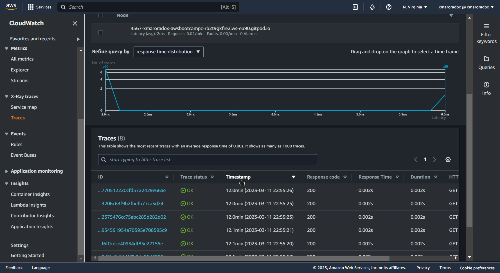

# Week 2 — Distributed Tracing

## Learning Time

### Watching the livestream

 Notes:
👨‍💻 When software is bigger than just code, you need to observe every part of the system.

💻 Programs -> debuggers; Systems -> Observability.

🔎 We keep track of a request throughout the whole system and its lifecycle through different services (A trace).

🔬 AWS-Xray is hard to instrument, as opposed to Honeycomb, which is scalable to teams.

📤 Export -> For all shells, other than that, we are setting the value in the current shell only.

🚀 When in production, use the most minimal image to optimize for security and speed. In development, do the opposite to make the most comfortable experience for your devs.
Seeing Trace actiivies

To know your key : <http://honeycomb-whoami.glitch.me/trace>
checkout : glitch.com

Obeserervailbility is better done early in the development process

### Watching Chirag Spending consedrations

Notes:
Honeycomb -> 20M event
Rollbar -> 5k error and data retention is 30 days
AWS-XRay -> 100k traces in the free tier
cloudwatch -> 10 metrics and alrams with 1M requests in the freetier

### Watching Security

Notes:
* 🌤️ Transitioning to the cloud means that you don't need to log everything.

* 👷 Depending on your workload, whether it's IaaS, PaaS, or SaaS, you may not need to log the infrastructure and the app that your services run on. You would only need to log the firewall and traces in the services itself only.

* 🚫 Logging can be bad because it's like a haystack, and finding a needle in it is like looking for a needle in a haystack. In distributed systems, it's a haystack of haystacks, and it puts more effort on the teams that handle logging, such as SOC and application teams.

* 👀 Observability makes it easier than logging, easing the work needed by the individuals in the observability team, and making working with other teams easier as you can quantify data easily.

* 💰 It isn't as costly as logging, as it reduces overall operational costs.

* 🕵️ You can see the whole trace throughout your network and understand application health.
Observaibliity vs monitoring:

Obserervailtity : is where every micro action through out the network
where monitoring is an outer scope of the systems

The following AWS services publish metrics to CloudWatch:

* CloudTrail
* CloudWatch Agent
* CloudWatch Metrics
* X Ray traces
* AWS Private CA
* AWS Certificate Manager
* AWS Backup
* Amazon Inspector
* AWS KMS

Tracing isn't mature yet and observaibility is new

Central Observability Platform - Security:

* SIEM (Security Incident and Event Management)
* AWS Security Hub with Amazon EventBridge
* Event Driven Architecture with AWS Services
* Open Source Dashboards

### Instrumeting X-ray

Notes:
Middleware is used in web apps  to do lots of things:

* Handle authentication
* white/block list addresses
* ensure format and size of files
* telemetery

setting x-ray :

this one was a bit diffcult as I had to reconfigure my keys
note to self : ensure you are using your keys when doing such things

creating sampling rule:

Instrumented with x-ray:

### CloudWatch Logs

Implemented Cloud watch logs

## Watching Open up the cloud Video

Sins when working in the cloud:
badge collection: you shouldn't be badge hunting and you are not defined by what badges you have

Stacking some good certifications like kubernetes might be a good evidence 
doing open source also adds to depth whether it's your own or others

professional experience is creme de la creme

looks for skills that the market need and show comptenece in them
Projects

I should always test my skilss against the market

Golden rule when learning new skills: 

## Open Cloud Homework

#### My journey to the cloud 

#### My 5 jobs 

*[Cloud Internship]( https://www.indeed.com/viewjob?jk=c238fe6c222e5953&q=Cloud+Engineer+Intern&tk=1gr6g179ikv8o800&from=ja&alid=61dc6dea3df5b162c80f111d&utm_campaign=job_alerts&utm_medium=email&utm_source=jobseeker_emails&rgtk=1gr6g179ikv8o800)

Role: Support 

Skill: 

AWS and/or Google Cloud (GCP) adoption
Cloud Account, Financial and overall Enterprise Governance
Security in Cloud
Infrastructure Automation Tools (Terraform)
Continuous Integration tools (Jenkins, etc)
Container Services (e.g. Kubenetes, Docker)
Scripting proficiency (Python, Javascript, PowerShell)

* [Cloud Platform](https://www.indeed.com/viewjob?jk=81f460cf1edc57e6&q=Cloud+Engineer+Intern&tk=1gr467l1fkv8o800&from=ja&alid=61dc6dea3df5b162c80f111d&utm_campaign=job_alerts&utm_medium=email&utm_source=jobseeker_emails&rgtk=1gr467l1fkv8o800)

Role: Engineer 
Skills: 
Experience using Google Cloud and/or Kubernetes
Knowledge of OpenTelemetry
Knowledge of Go, BASH, Terraform
Experience writing technical documentation or building codelabs

* [Cloud ops engineer] (https://careers.caci.com/global/en/job/CACIGLOBAL278196EXTERNALENGLOBAL/AWS-Cloud-Operations-Engineer?utm_source=indeed&utm_medium=phenom-feeds&utm_source=Indeed&utm_medium=organic&utm_campaign=Indeed)
Role :Engineer
Skills : 
Experience with Deployment Management tools such as Chef, Ansible or Puppet
Knowledge of commonly used AWS services, such as IAM, VPC, CloudWatch and CloudTrail, Route 53, RDS, SSM and Lambda.
Experience working with Agile Development practices.

* [Senior DevOps Engineer](https://brightskiesinc.com/jobs/senior-devops-engineer-2/)
Role: Engineer 
Skills:
Linux/Unix 
[bash – python].
[Ansible].
[kubernetes].

* [Sales Engineer](https://m5.apply.indeed.com/beta/indeedapply/postresumeapply)
Role :Sales
Skils:
VMware portfolio (vSphere, VSAN, NSX, Horizon view, Horizon App, WS1, AW, Pivotal cloud, App defense, integration for other product, sizing mechanism, ..etc.)
servers (cisco, dell, fujitsu)

This one in particular I found the description not relative 