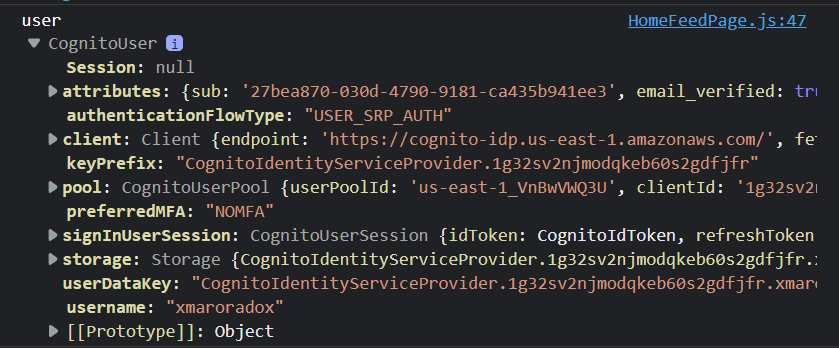

# Week 3 — Decentralized Authentication

## Learning Time

### Watching the livestream

* Creating a  cognito user pool

* Created a user

* Signed with this user

* Recieved Token from cognito

### Watching Verifying congnito jwt server side:

#### Notes:
This Video is really hard and understanding it needs a good technical person glad this video exists

### Watching Exploring Jwt:

#### Notes:
* while it is possible to use the AWS Cognito identity provider to verify access tokens, it is not the best solution because it involves hitting an external API to verify the token, and also because it retrieves additional data that is not required.

* ther options such as the AWS SDK for Python, and the AWS JWT Cognito library. The latter is a JavaScript library that does not have a Python equivalent