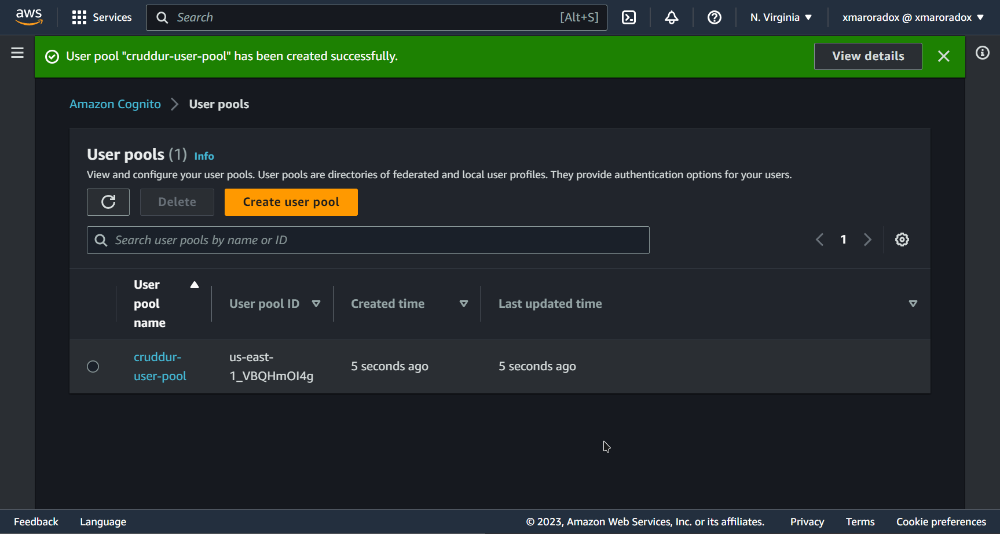

# Week 3 — Decentralized Authentication

## Learning Time

### Watching the livestream

* Creating a  cognito user pool

* Created a user

* Signed with this user

* Recieved Token from cognito

### Watching Verifying congnito jwt server side:

#### Notes:
This Video is really hard and understanding it needs a good technical person glad this video exists

### Watching Exploring Jwt:

#### Notes:
* while it is possible to use the AWS Cognito identity provider to verify access tokens, it is not the best solution because it involves hitting an external API to verify the token, and also because it retrieves additional data that is not required.

* ther options such as the AWS SDK for Python, and the AWS JWT Cognito library. The latter is a JavaScript library that does not have a Python equivalent

### Changed the UI
Picked some new colors and did a revamp

Sign-Screen:

Home-Screen:

### Watching Amazon cognito security best practices

#### Notes:

* Security Assertion Markup Language (SAML). Its primary role in online security is that it enables you to access multiple web applications using one set of login credentials.
* OAuth 2.0 is an authorization service that is often used in conjunction with OpenID Connect.  noted that the principle behind these services is to only store a user's username and password at one location, rather than creating new credentials for each new application.
* DeCentralized Authencation : Authorize from one place to many services using a protocol
* Why use Cognito:

    • User Directory for Customers

    • Ability to access AWS Resources for the Application being built

    • Identity Broker for AWS Resources with Temporary credentials

    • Can extend users to AWS Resources easily
* User LifeCycle Mangement:
 
• Onboarding you are provided credentails -> by time your credentails increase or decrease

• you need to enforce these policies as they grow or shrink

• when offboarding you need to be sure your users are off

* Token Lifecyle Managment: 

* Amazon Cognito — Security Best Practices :
    • AWS Services - API Gateway, AWS Resources shared with the App
    Client (Backend or Back channels)

    • AWS WAF with Web ACLs for Rate limiting, Allow/Deny List, Deny access
    from region & many more waf management rules similar to OWASP
    (marketplace)

    • Amazon Cognito Compliance standard is what your business requires

    • Amazon Cognito should only be in the AWS region that you are legally
    allowed to be holding user data in.

    • Amazon Organizations SCP - to manage User Pool deletion, creation,
    region lock etc

    • AWS CloudTrail is enabled & monitored to trigger alerts on malicious
    Cognito behaviour by an identity in AWS.

* Amazon Cognito - Security Best Practices - Application

    • Application should use an industry standard for Authentication &
    Authorization (SAML, OpenID Connect, OAuth2.O etc)

    • App User Lifecycle Management - Create, Modify, Delete Users

    • AWS User Access Lifecycle Management - Change of Roles/ Revoke
    Roles etc

    • Role based Access to manage how much access to AWS Resources for
    the Application being built

    • Token Lifecycle Management - Issue new tokens, revoke compromised
    tokens, where to store (client/server) etc.

    • Security tests of the application through penetration testing

    • Access Token Scope - should be limited

    • JWT Token best practice - no sensitive info

    • Encryption in Transit for API Calls