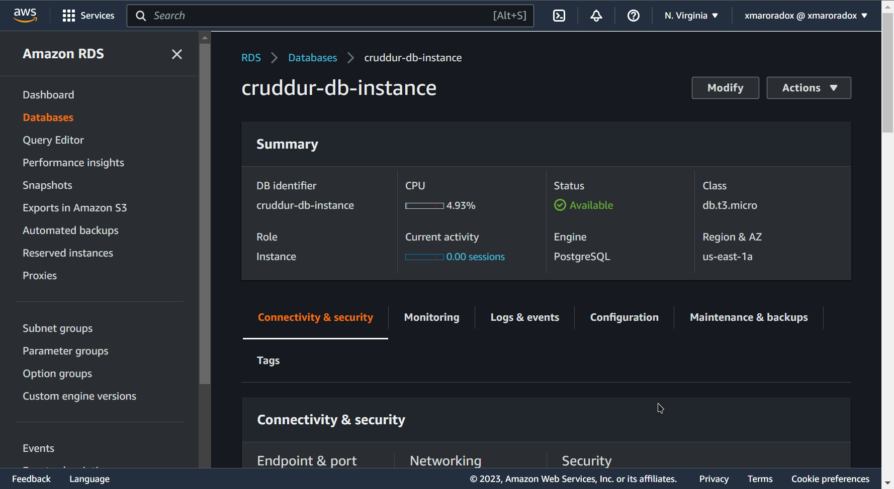

# Week 4 — Postgres and RDS

## Learning Time

### Watching the livestream

* setup rds

* side note : noting down and working at the same time is hard hahaha 😆

### Doing Cognito Post Confirmation lambda

#### Notes:

### Watching Creating Activities
Created my crud on rds yayyy

#### Notes:
* it is better to sanatize input 

### Watching Security video

#### Notes:
* be sure to create the db in the region where you comply with rules
* Don't make your db publicly acessible
* you need to make your db accesible to your dev team only

Amazon RDS - Security Best Practices - AWS:

• Use VPCs: Use Amazon Virtual Private Cloud (VPC) to create a private
network for your RDS instance. This helps prevent unauthorized access
to your instance from the public internet.
• Compliance standard is what your business requires
• RDS Instances should only be in the AWS region that you are legally
allowed to be holding user data in.
• Amazon Organizations SCP - to manage RDS deletion, RDS creation,
region lock, RDS Encryption enforced etc
• AWS CloudTrail is enabled & monitored to trigger alerts on malicious
RDS behaviour by an identity in AWS.
• Amazon Guardduty is enabled in the account and region of RDS

Amazon RDS - Security Best Practices - Application:

• RDS Instance to use appropriate Authentication -Use IAM
authentication, kerberos etc (not the default)
• Database User Lifecycle Management - Create, Modify, Delete Users
• AWS User Access Lifecycle Management - Change of Roles/ Revoke
Roles etc
• Security Group to be restricted only to known IPs
• Not have RDS be internet accessible
• Encryption in Transit for comms between App & RDS
• Secret Management: Master User passwords can be used with AWS
Secrets Manager to automatically rotate the secrets for Amazon RDS.
