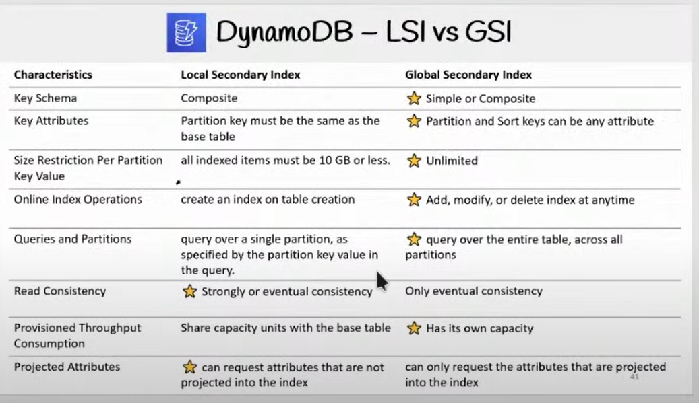

# Week 5 — DynamoDB and Serverless Caching

## Learning Time

### Watching the livestream

  [LINK to Diagram](https://lucid.app/lucidchart/8f58a19d-3821-4529-920f-5bb802d6c6a3/edit?invitationId=inv_e47bc316-9caa-4aee-940f-161e01e22715&page=0_0#)
  

Table Design:

  Notes :
  When Designing a DynamoDB Table take note of access pattern and scienaros that users will engage through
  nosql tables don't have joins so be careful when Designing your DynamoDB
  particledb is a tool to make nosql act like a sql one

  Primary key vs partition key 
  primary key can be simple = partition key 
  partition key can be primary key + sort key
  

LSI (Local Secondary Index) and GSI (Global Secondary Index) are two types of secondary indexes that can be created in DynamoDB.

LSI is an index that has the same partition key as the table, but a different sort key. It can only be created at the time of table creation and cannot be modified later. LSI is useful when you want to query data based on a different sort order than the one provided by the table's primary key.

GSI, on the other hand, is an index that has a different partition key and sort key than the table. It can be created at any time and can be modified later. GSI is useful when you want to query data based on attributes that are not part of the primary key.

WRU (Write Request Units) and RCU (Read Capacity Units) are units of measurement used in DynamoDB to determine the capacity needed for read and write operations. Each DynamoDB table has a certain number of provisioned RCU and WRU, which determine the maximum number of read and write operations that can be performed per second.

A single RCU represents one strongly consistent read per second or two eventually consistent reads per second, with each read operation accessing an item of up to 4 KB. Similarly, a single WRU represents one write operation per second, with each write operation adding an item of up to 1 KB in size. If the size of the item exceeds the specified limit, additional RCU or WRU are consumed accordingly.

When performing read or write operations, DynamoDB consumes the corresponding RCU or WRU for that operation. If the number of requests exceeds the provisioned capacity, additional requests are throttled and must be retried later. To avoid throttling, it's important to provision enough RCU and WRU for your DynamoDB table.
  