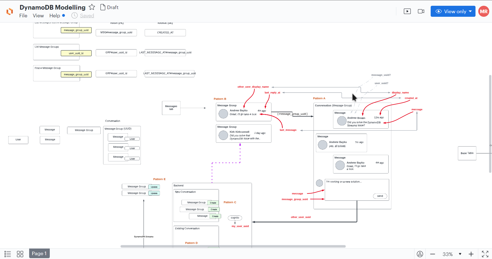
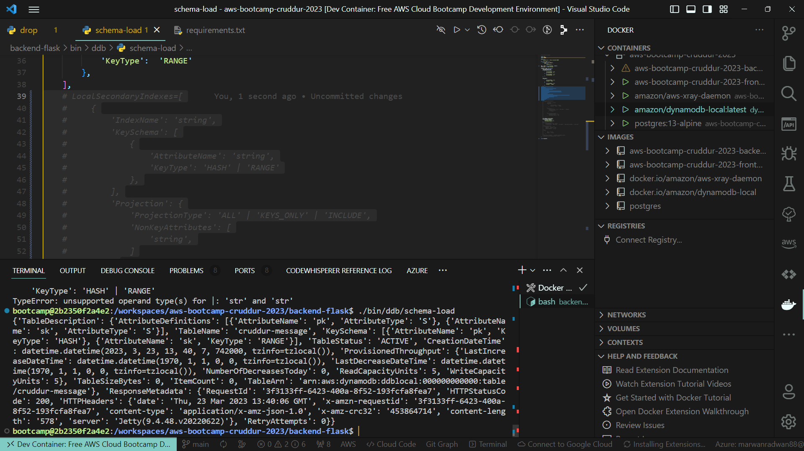
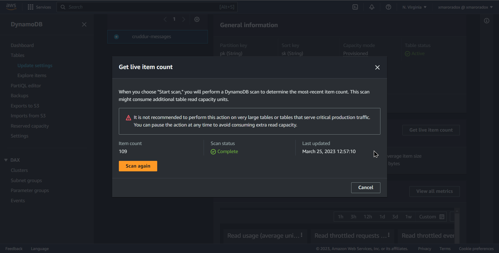
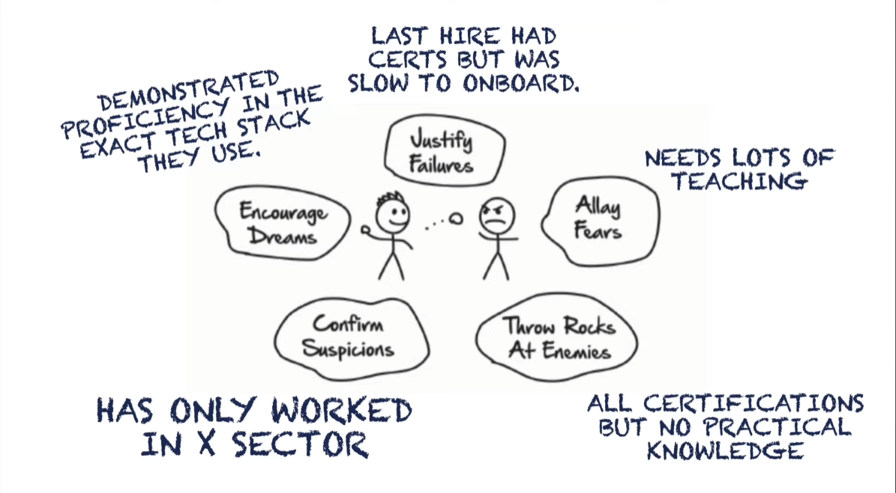
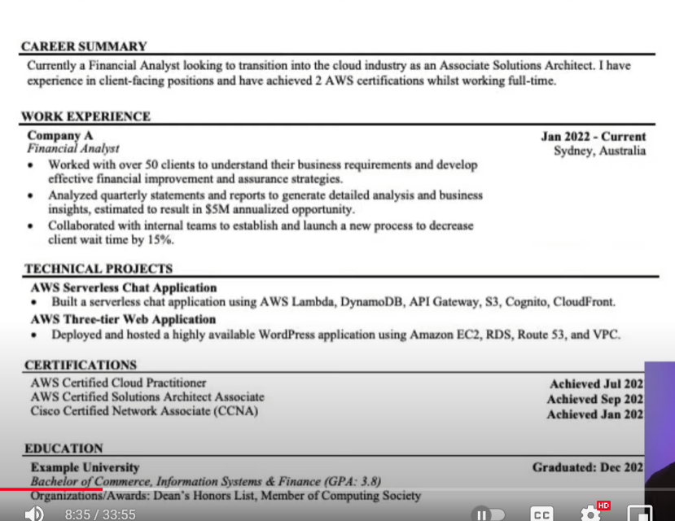
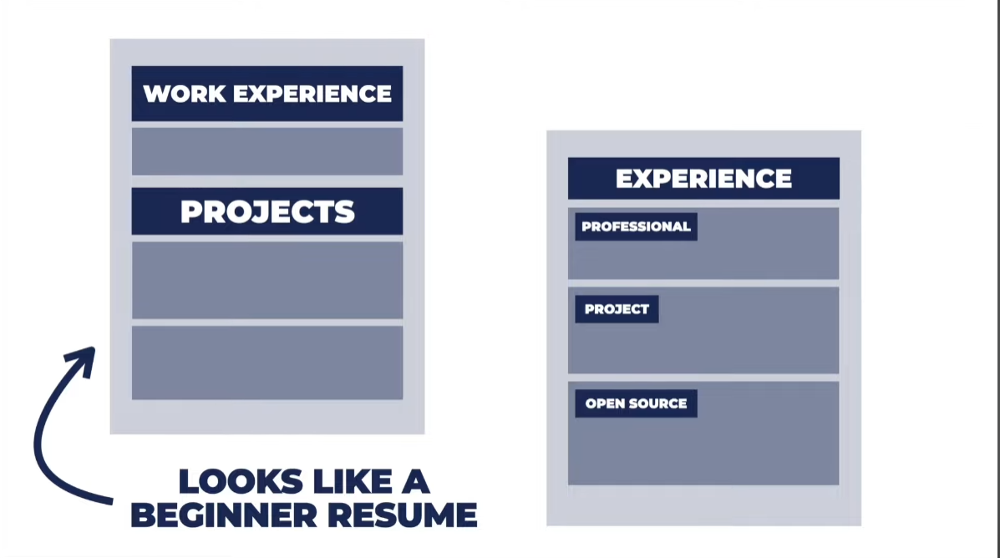
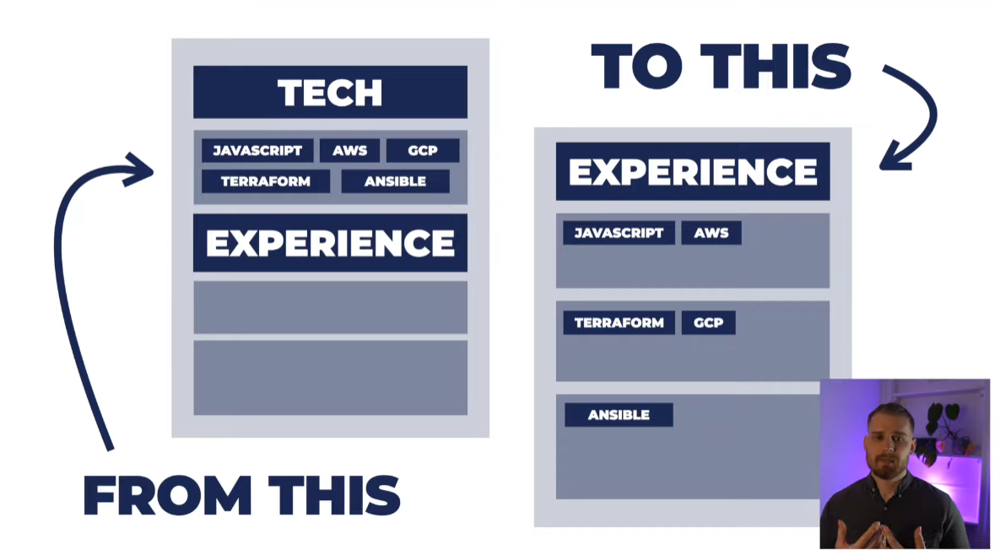
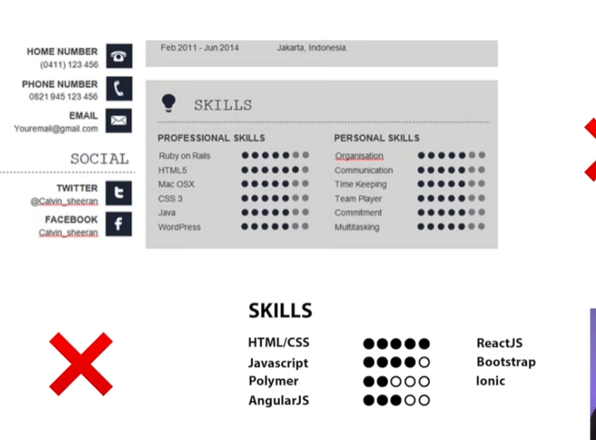

# Week 5 — DynamoDB and Serverless Caching

## Learning Time

### Watching the livestream

[LINK to Diagram](https://lucid.app/lucidchart/8f58a19d-3821-4529-920f-5bb802d6c6a3/edit?invitationId=inv_e47bc316-9caa-4aee-940f-161e01e22715&page=0_0#)

Table Design:

Notes :
When Designing a DynamoDB Table take note of access pattern and scienaros that users will engage through
nosql tables don't have joins so be careful when Designing your DynamoDB
particledb is a tool to make nosql act like a sql one

Primary key vs partition key
primary key can be simple = partition key
partition key can be primary key + sort key

LSI (Local Secondary Index) and GSI (Global Secondary Index) are two types of secondary indexes that can be created in DynamoDB.

LSI is an index that has the same partition key as the table, but a different sort key. It can only be created at the time of table creation and cannot be modified later. LSI is useful when you want to query data based on a different sort order than the one provided by the table's primary key.

GSI, on the other hand, is an index that has a different partition key and sort key than the table. It can be created at any time and can be modified later. GSI is useful when you want to query data based on attributes that are not part of the primary key.

WRU (Write Request Units) and RCU (Read Capacity Units) are units of measurement used in DynamoDB to determine the capacity needed for read and write operations. Each DynamoDB table has a certain number of provisioned RCU and WRU, which determine the maximum number of read and write operations that can be performed per second.

A single RCU represents one strongly consistent read per second or two eventually consistent reads per second, with each read operation accessing an item of up to 4 KB. Similarly, a single WRU represents one write operation per second, with each write operation adding an item of up to 1 KB in size. If the size of the item exceeds the specified limit, additional RCU or WRU are consumed accordingly.

When performing read or write operations, DynamoDB consumes the corresponding RCU or WRU for that operation. If the number of requests exceeds the provisioned capacity, additional requests are throttled and must be retried later. To avoid throttling, it's important to provision enough RCU and WRU for your DynamoDB table.

### Watching DynamoDb utility scripts video

created ddb table

### DynamoDB screenshots

Got Messaging yay

### Ashish's DynamoDB Considerations

Notes:
🔒💻 DynamoDB is commonly used in high-traffic web applications, such as e-commerce platforms, where it can handle large volumes of data and support fast read and write operations.

📈 Another common use case for DynamoDB is in real-time analytics applications, where it can quickly process and analyze large amounts of data in near real-time.

📱🎮 DynamoDB is also well-suited for mobile and gaming applications, where it can provide a scalable and responsive backend for user data, game progress, and other application data.

🔐🌐 DynamoDB can be accessed from within an Amazon Virtual Private Cloud (VPC) using VPC endpoints, which allow traffic to flow directly to the DynamoDB service without traversing the public internet.

🔍🔑 VPC endpoints for DynamoDB support both interface endpoints and gateway endpoints, with the former enabling API access to DynamoDB and the latter providing access through a VPC endpoint gateway.

💾 Amazon DAX is a fully-managed, in-memory cache for DynamoDB that improves read performance and reduces response times by caching frequently accessed data.

🛡️ DAX can be accessed via endpoints within a VPC, providing a secure and private way to access DynamoDB without needing to expose the database to the public internet.

💰 Using DAX can significantly reduce the number of requests made to DynamoDB, which can help lower overall operational costs and improve the scalability of DynamoDB-based applications.

🔒🔐📜 Amazon DynamoDB - Security Best Practices - AWS
• Use VPC Endpoints: Use Amazon private network from your application or Lambda to a DynamoDB. This helps prevent unauthorized access to your instance from the public internet.
• Compliance standard is what your business requires
• Amazon DynamoDB should only be in the AWS region that you are legally allowed to be holding user data in.
• Amazon Organizations SCP - to manage DynamoDB Table deletion, DynamoDB creation, region lock etc
• AWS CloudTrail is enabled & monitored to trigger alerts on malicious DynamoDB behaviour by an identity in AWS.
• AWS Config Rules (as no GuardDuty even in Mar'2023) is enabled in the account and region of DynamoDB

🔒💻 Amazon RDS - Security Best Practices - Application
• DynamoDB to use appropriate Authentication - Use IAM Roles/ AWS Cognito Identity Pool Avoid IAM Users/Groups
• DynamoDB User Lifecycle Management - Create, Modify, Delete Users
• AWS IAM roles instead of individual users to access and manage DynamoDB
• DAX Service (IAM) Role to have Read Only Access to DynamoDB (if possible)
• Not have DynamoDB be accessed from the internet (use VPC Endpoints etc)
• Site to Site VPN or Direct Connect for Onpremise and DynamoDB Access
• Client-side encryption is recommended by Amazon for DynamoDB.

### Watching open up the cloud

managerial fears when hiring

cv structure

Focus on the big parts and bold the things you are good at 
working with teams can show experience
increase depth by doing more valuable projects or upgrading your certs

Resume Notes:
1- Image is not really necessary and should not be included
2- should add an overview ???
3- add context about roles
4- decrease white space
5- story between roles
6-UNDERSTAND "OPERATIONS" (ALERTING, ON CALL)
7-ANALYSE INFRASTRUCTURE COST
8-SHOW YOU THINK ABOUT TRADE-OFFS
9-SHOW PRAGMATISM ("CODE IS A LIABILITY")
10-SHOW COMPANIES BUILD (INFRA AS CODE, PULL REQUESTS)
11-CIVE HARD EVIDENCE OF YOUR SKILLS, E.C. GITHUB
12- Add techonolgies you use and which frameworks
13- add data to back up your experience

Resume 2: 
HAVE A SUMMARY
Dont' over empahsize certs and eductation 
Give your project the context it needes
Incoprate StakeHolders as possible

Resume 3:
Show the outcome 
Have coherence to your story

Resume Structure:

Open Up the cloud Task:

WRITE FEARS + DREAMS OF HIRING MANAGER:
The hiring manager for a cloud computing engineering position may have fears related to hiring someone who lacks experience or skills in cloud computing. They may also be concerned about hiring someone who cannot work effectively in a team or meet deadlines.

The dreams of the hiring manager would be to find a candidate who has a strong understanding of cloud technologies and experience working with them. They would also want someone who is adaptable to new situations and able to work both independently and in a team. Additionally, they would want someone who is an excellent problem solver and can effectively communicate complex information.

RE-ORDER YOUR RESUME ON CONTENT HIERARCHY:

Introduction: Name, email, phone number, and location.
Links: LinkedIn, GitHub, and HashNode.
Projects: Cruddur, BAM, and relevant technologies.
Achievements and Certifications: AWS Cloud Project Bootcamp, AWS Certified Cloud Practitioner, NASA SPACE APPS CAIRO, and relevant technologies.
Education: BSc in Computer and communications engineering, Expected Graduation 2024, AWS Academy Certified.
Key Skills and Characteristics: Proficient in cloud technologies, version control systems, containerization and deployment, web development technologies, Python, agile development methodologies, project management tools, problem-solving skills, flexibility, clear communication, and time management.
Activities and Interests: Recreational basketball and seeking out novel experiences.

MAP YOUR EXPERIENCE ON CREDIBILITY MATRIX:

Technical Ability:

AWS Academy Certified in Cloud Architecting, Cloud Operations, Cloud Developing, Cloud Security Foundations, and Cloud Foundations.
Proficient in cloud technologies, containerization and deployment, web development technologies, and Python.

Interpersonal Skills:

Collaborated with a team of 6 persons on the NASA SPACE APPS CAIRO project.
Clear communication skills with excellent listening and feedback skills.
Able to work effectively in both team and individual settings.
Business Acumen:

Successfully implemented measures to optimize resource utilization through vigilant monitoring and improved controls.
Streamlined daily operations by devising and implementing efficient schedules to manage workloads.
Leadership:
I have none mentioned in the resume

IDENTIFY OPPORTUNITIES TO MOVE UP:

Obtain additional cloud computing certifications to demonstrate proficiency in specific areas such as AWS Solutions Architect or Microsoft Azure.
Gain leadership experience by volunteering for project management roles or leading a team of engineers.
Attend industry conferences and networking events to stay up-to-date with the latest technologies and trends in cloud computing.
Pursue advanced education such as a Master's degree in cloud computing or related fields.