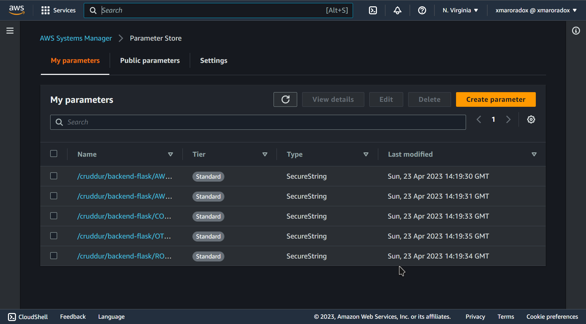
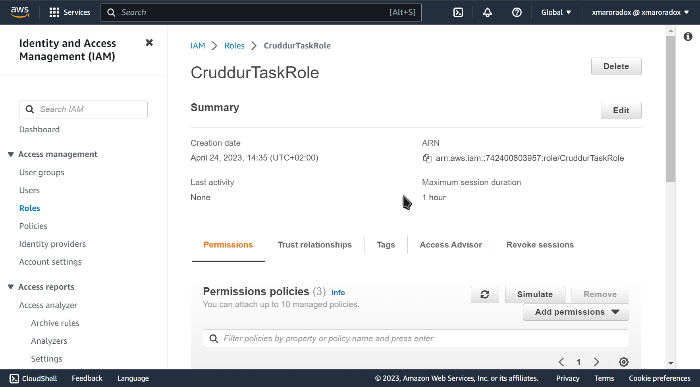

# Week 6 — Deploying Containers

## Watching Security Video

Notes:

Amazon Elastic Compute Cloud (EC2) is a
virtual machine service that provides users with
full control over the infrastructure, allowing
them to configure and manage their
applications and security settings. EC2
instances can run any operating system and
support a wide range of applications, making it
a versatile solution for various use cases. EC2
can also be used to build complex, multi-tier
architectures and scale applications
horizontally and vertically.

Amazon Elastic Container Service (ECS), on the
other hand, is a container management service
that abstracts away the infrastructure and
simplifies the deployment and management of
Docker containers. ECS manages the cluster
infrastructure, scheduling, and orchestration of
containers, enabling users to focus on their
application code. ECS is ideal for containerized
applications that require rapid scaling and high
availability.

EC2 and ECS have different security models.
EC2 provides users with full control over the
underlying infrastructure, which means they
are responsible for securing the operating
system, applications, and data. Users must also
manage security groups, network access
control lists, and other security settings. In
contrast, ECS abstracts away the infrastructure,
and AWS manages the underlying security
settings, including operating system updates,
patching, and infrastructure security.

ECS also provides additional security features,
such as integration with AWS Identity and
Access Management (IAM) and AWS Key
Management Service (KMS), which enable
users to manage access control and encryption
keys for their containerized applications. ECS
also supports Amazon Elastic Container
Registry (ECR), which provides a secure and
scalable repository for storing and managing
Docker images. Overall, ECS simplifies the
security management of containerized
applications and provides users with additional
security features.

Security Challenges with AWS
Fargate
• No visibility of Infrastructure
• Ephemeral Resources makes it hard to do triage or
Forensics for detected threats
• No file/network monitoring
• Cannot run traditional Security Agents in Fargate
• User can run unverified Container images
Containers can run as root and even with elevated
priviledges

Cloud Control Plane Configuration - Access Control, Container Images etc
Choosing the right Public or Private ECR for Images
Amazon ECR Scan Images to "Scan on Push" using Basic or Enhanced
(Inspector + Snyk)
Use VPC Endpoints or Security Groups with known sources only
Compliance standard is what your business requires
Amazon Organizations SCP - to manage ECS Task deletion, ECS creation,
region lock etc
AWS CloudTrail is enabled & monitored to trigger alerts on malicious
ECS behaviour by an identity in AWS.
AWS Config Rules (as no GuardDuty (ECS) even in Mar'2023) is enabled

Amazon ECS - Security Best Practices - Application
• Access Control - Roles or IAM Users for ECS Clusters/Services/Tasks
• Most recent version of ECR Agent daemon on EC2
• Container Control Plane Configuration - Root privileges, resource
limitations etc
• No secrets/passwords in ECS Task Definitions e.g db password etc-
Consider AWS Secret Manager
• No secrets/passwords in Containers - Consider AWS Secret Manager
• Only use Trusted Containers from ECR with no HIGH/CRITICAL
Vulnerabilities
• Limit ability to ssh into EC2 container to read only file systems- use
APIs or GitOps to pull information for troubleshooting
• Amazon CloudWatch to monitor Malicious ECS Configuration Changes
• Only using Authorized Container Images (hopefully some image signing
in the future e.g sigstore)

# Watching the Live Stream

* Added Healthcheck for rds
* Added Health check for the backend
* Created a docker repo
* Pushed Image to registry
* Added task definition (maybe should bump the cpu or memory later)
* Added service exeuction policy
* Created Parameters
  
   

* Create Role
   
   

* created service
* setup loadbalancer
my step by step :

https://scribehow.com/shared/ECS_FARGATE_BACKEND_SETUP__sxhC78mcSvm2D6l-AvN62A
https://scribehow.com/shared/Setting_Up_Frontend__gN3MhDp9RGqV81KAvwhVUA
https://scribehow.com/shared/frontend_setup_part_2__R-l5FMkTSR6TPx4Q1zdtfw
https://scribehow.com/shared/setting_up_frontend_part_3__skkSQPRaThiShyHDXaAc6Q
https://scribehow.com/shared/How_to_update_connection_URL_for_backend_Flask__WElRQ2HJT3u7vCUMfXvtQQ
https://scribehow.com/shared/How_to_Deploy_a_Dockerized_Flask_Application__Am3kJhiURQCk633eeLRRdA

changed domain to cruddur.marorado.com 
https://scribehow.com/shared/How_to_Deploy_a_React-Flask_Web_Application__LL5MK1HLRKasgfIzx59DKw

Fixing Acess Token
https://scribehow.com/shared/Fixing_Access_Token__SJYNnNzxRuCCe5YO6-KSkg