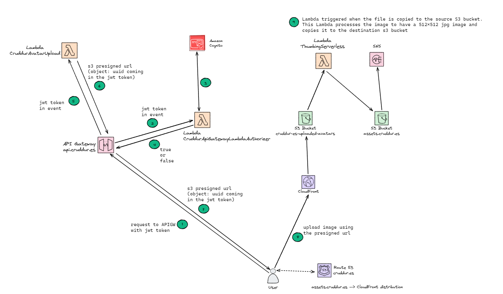

# Week 8 — Serverless Image Processing

Live Stream notes :
single process per a single container
use case for bridge mode 
fargate -> vpc mode 
ec2 _.> host mode 1 port to 1 container
ec2 -> bridge mode multi container on 1 port 
ec2 ->
host mode will expose one port to one um we'll take
the same port located on
the um physical host and expose it to one container
one to one
so you can now have two applications running as in a
container on Port 80 on the same Ecto ec2 hosts if
you do want
to do that and run multiple instantiations of a
container running on the same intemal Port you would
bridge bridge networking mode and use something
like an AWS load balancer or an application load

Security video notes:
• Integration with ACM (Amazon Certificate Manager) for TLS
• Compliance standard is what your business requires for a DNS provider
• Amazon Organizations SCP - to manage Route53 actions like creation,
deletion, modification of production URIs etc
• AWS CloudTrail is enabled & monitored to trigger alerts for malicious
activities e.g Associate VPC with Hosted Zone, Change Resource Recorc
Sets, Register Domain etc
• GuardDuty is enabled for monitoring suspicious DNS comms (e.g
Crypto-mining etc) and automated for auto-remediation.
• AWS Config Rules is enabled in the account and region of ECS
• Access Control - Roles or IAM Users for making DNS changes in Amazon
Route53.
• Public vs Private Hosted Zones
• All Route53 records should point to an existing DNS, ELB, ALB or AWS S3
- Watch Out for Dangling DNS domains
• Hosted Zone Configuration Changes limited to small set of people.
• Enable Encryption in Transit using TLS/SSL certification e.g HTTPS Urls.
• Only use Trusted Domain Providers for requesting new DNSs.
• Set TTLs appropriately to afford to wait for a change to take effect
• Ensure Root Domain Alias Record Points to ELB
• Develop process for continuously verifying if DNS (& Hosted Zone)
all current and valid.

### LIVE STREAM WEEK 8
CDK IS SIMILAR TO A CLOUDFORMATION TEMPLATE
cloud formation you define you structure in json or yaml 
cdk uses progamming languages intstead of json or yaml
cdk is open source
you use constructs are like objects you use to build your instructure

